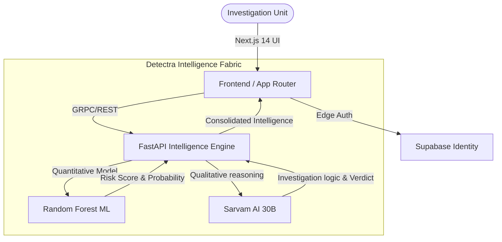

<div align="center">

# 🛡️ Detectra
### **Enterprise Grade Fraud Intelligence & AI-Powered Investigation Unit**

[](https://nextjs.org/)
[](https://fastapi.tiangolo.com/)
[](https://www.sarvam.ai/)
[](https://supabase.com/)
[](https://tailwindcss.com/)
[](https://www.framer.com/motion/)

**Detectra** is a high-performance fraud detection platform designed for modern insurance investigation units (SIU). By combining traditional Machine Learning with state-of-the-art Generative AI, Detectra provides sub-second risk assessment and actionable intelligence to thwart fraudulent activities.

</div>

---

## 📽️ Deep Dive: The Fraud Intelligence Stack

Detectra operates as a hybrid engine—leveraging a local **Random Forest** model for quantitative risk scoring and **Sarvam AI's 30B LLM** for qualitative analysis and investigative guidance.

### **Core Capabilities**

- **⚡ Real-time Fraud Scoring**: Instantly evaluate claim risk based on historical patterns, policy age, and frequency spikes.
- **🤖 AI Investigator**: An integrated chatbot powered by Sarvam AI that provides specific investigative steps for complex fraud patterns.
- **📊 Executive Dashboard**: A premium, minimalist interface for monitoring high-risk claims, approval rates, and global fraud trends.
- **🌍 Multi-lingual Support**: Native integration with Sarvam's Bulbul V3 for professional summaries and multi-modal support.
- **🔒 Enterprise Security**: Secure authentication and identity management powered by Supabase.

---

## 🏗️ Technical Architecture & Ecosystem

Detectra is engineered on a **High-Efficiency Distributed Intelligence Fabric**, designed to handle high-concurrency fraud analysis with ultra-low latency. The system employs a multi-layered orchestration pattern to synthesize quantitative Machine Learning outputs with sophisticated Generative AI reasoning.


### **Architectural Pillars**

- **⚡ Intelligence Orchestration**: A specialized FastAPI-driven core that multiplexes between local Scikit-Learn models for rapid quantitative scoring and **Sarvam AI's 30B LLM** for deep qualitative investigation.
- **⚛️ Edge-Optimized Frontend**: A Next.js 14 (App Router) interface leveraging React Server Components (RSC) and Framer Motion for a premium, high-performance investigator experience.
- **🛡️ Hardened Identity & Data**: A robust Supabase/PostgreSQL backbone providing enterprise-grade JWT authentication and encrypted persistence for high-sensitivity claims.
- **🔄 Asynchronous Logic Pipelines**: Parallelized processing for dynamic signal generation, flag detection, and AI-driven verdict synthesis.



---

## 📁 Repository Structure

```bash
├── frontend/           # Next.js 14 Dashboard & Landing
│   ├── src/app/        # Modern App Router architecture
│   ├── src/components/ # Premium UI components (Framer Motion)
│   └── src/data/       # Mock datasets for dashboard simulation
├── backend/            # Python FastAPI Intelligence Service
│   ├── main.py         # AI Logic & ML Inference Pipeline
│   ├── models/         # Pre-trained Scikit-Learn artifacts
│   └── requirements.txt# Enterprise-grade dependencies
└── .env.example        # Centralized configuration manifest
```

---

## 🚀 Deployment Guide

### **1. Prerequisites**
- **Node.js**: 18.0 or higher
- **Python**: 3.9+ 
- **Supabase Account**: For authentication and persistence.
- **Sarvam AI API Key**: For LLM-powered investigative logic.

### **2. Installation**

```bash
# Clone the repository
git clone https://github.com/pranavgawaii/Detectra.git
cd Detectra

# Install Frontend dependencies
cd frontend && npm install

# Install Backend dependencies
cd ../backend && pip install -r requirements.txt
```

### **3. Configuration**
Rename `.env.example` to `.env` in the root and provide your credentials:
```env
NEXT_PUBLIC_SUPABASE_URL=your_supabase_url
NEXT_PUBLIC_SUPABASE_ANON_KEY=your_supabase_key
SARVAM_API_KEY=your_sarvam_key
```

### **4. Launching the Local Stack**
You can launch both services simultaneously using the root package runner:
```bash
# From the root directory
npm run dev
```

---

## 🛠️ Tech Stack & Credits

- **Frontend**: [Next.js 14](https://nextjs.org/), [Tailwind CSS](https://tailwindcss.com/), [Framer Motion](https://framer.com/motion)
- **Backend**: [FastAPI](https://fastapi.tiangolo.com/), [Scikit-Learn](https://scikit-learn.org/), [Joblib](https://joblib.readthedocs.io/)
- **AI Engine**: [Sarvam AI (30B Model)](https://www.sarvam.ai/)
- **Data Layer**: [Supabase / PostgreSQL](https://supabase.com/)
- **Icons**: [Lucide React](https://lucide.dev/)

---

<div align="center">
  <strong>Forging the future of insurance security.</strong><br>
  Built with ❤️ by the Detectra Team | © 2026
</div>
