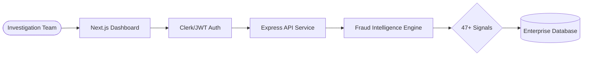

<div align="center">

# Detectra | Enterprise Fraud Intelligence
**Next-Gen sub-second AI engine for elite insurance investigation units.**

[](https://nextjs.org/)
[](https://tailwindcss.com/)
[](https://www.typescriptlang.org/)
[](https://detectra.io)
[](https://detectra.io)


</div>

---

## 💎 Core Overview
Detectra bridges the gap between massive insurance data streams and actionable fraud insights. Our engine surfaces **47+ unique fraud signals** instantly, slashing manual triage time by up to 85% for Special Investigation Units (SIU).

### ⚔️ Key Features
- **🧠 AI Verdict Engine**: Real-time 0–100 risk scoring with LLM-powered natural language explanations.
- **🛰️ Spatial Analysis**: Deep geo-spatial risk mapping and network anomaly detection.
- **⚡ sub-second Triage**: Process thousands of claims per second via our optimized Next.js + Express stack.
- **🎨 Premium 'Emerald' UI**: A meticulously crafted dark interface designed for focus and elite performance.
- **🛠️ Dynamic Rules**: No-code logical flows for automated claim routing and escalation.

---

## 🏗️ Technical Architecture
Detectra maintains a strict separation of concerns through its professional monorepo design, ensuring scalability and security.



### 📁 Project Structure
```bash
├── frontend/           # Next.js 14 Dashboard Application
│   ├── src/app/        # High-performance SSR/CSR routes
│   ├── src/components/ # Reusable UI primitives & layout
│   └── public/         # Global assets & branding
├── backend/            # Express.js Fraud API
│   ├── server.js       # Signal processing & API logic
│   └── package.json    # Backend specialized dependencies
└── .config/            # Shared linting & environment config
```

---

## 🚀 Getting Started

### Prerequisites
- **Node.js**: 18.0 or higher
- **Package Manager**: npm, yarn, or pnpm

### Quick Deployment
1. **Clone & Enter**
   ```bash
   git clone https://github.com/pranavgawaii/Detectra-fraud-detection.git
   cd Detectra
   ```

2. **Automated Setup**
   ```bash
   npm run install:all
   ```

3. **Launch Ecosystem**
   ```bash
   npm run dev
   ```

| Command | Action |
| :--- | :--- |
| `npm run dev:frontend` | Start Next.js dashboard only |
| `npm run dev:backend` | Start Fraud API only |
| `npm run build:frontend` | Compile production bundle |

---

## 🔒 Security & Compliance
Detectra is built with enterprise-grade security at its core:
- **Data Privacy**: GDPR & CCPA compliant data handling.
- **Compliance**: Adheres to IRDAI guidelines for digital insurance systems.
- **Security**: Built-in protection against SQL injection, XSS, and CSRF via Next.js 14 security headers.

---

## 📜 License
Distributed under the **MIT License**. See `LICENSE` for more information.

<div align="center">
  <strong>© 2026 Detectra Technologies Pvt. Ltd. | Built for the future of insurance.</strong>
</div>
